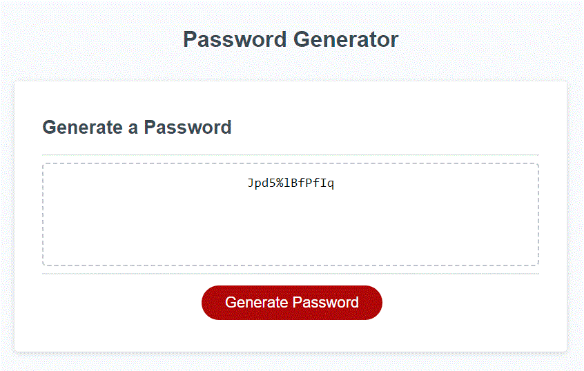

# Password Generator
Module 3 Challenge

## Description

The repository holds files to create a website that will generate a random password based on 
  1) the user's determination of the length of the password (8 to 128 characters)
  2) the user's determination of what character sets to include in the password

After user selects their options, a password that meets their criteria is provided.

## Installation

Contains\
  index.html\
  stylesheet style.css under directory assets/css\
  javascript script.js under directory assets/js\
  one image file under directory assets/images which is not used within the website\

## Screenshot

## Credits

Created entirely by Pete Maynard.

